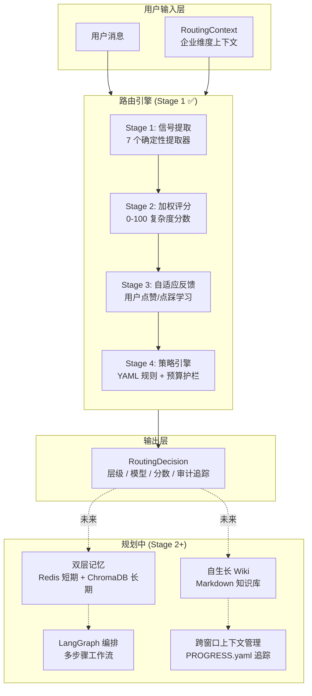
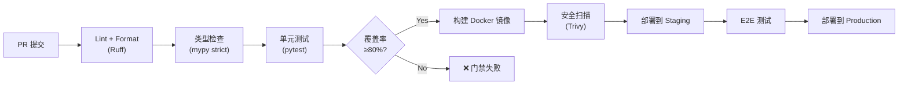
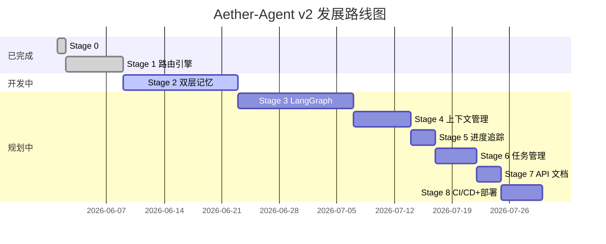

# Aether-Agent v2

<p align="center">
  <strong>自进化数字人 AI 伴侣 — 零 LLM 调用的智能路由引擎 + 自生长 Wiki + 长期记忆管理</strong>
</p>

<p align="center">
  <a href="#项目介绍">项目介绍</a> •
  <a href="#核心特性">核心特性</a> •
  <a href="#架构设计">架构设计</a> •
  <a href="#快速开始">快速开始</a> •
  <a href="#技术栈">技术栈</a> •
  <a href="#部署指南">部署指南</a> •
  <a href="#未来规划">未来规划</a>
</p>

---

## 项目介绍

**Aether-Agent v2** 是一个基于 LangChain 框架构建的、面向工程师和企业用户的 **个性化自进化数字人 AI 系统**。其核心理念是通过智能上下文管理和长期记忆维护，将 AI 交互沉淀为 **自生长知识库（Wiki）**，最终进化为具有个人/企业特色的"数字分身"。

### 为什么需要 Aether-Agent？

当前 AI 助手的普遍痛点：

| 痛点 | Aether-Agent 的解决方案 |
|------|------------------------|
| 每次对话无记忆，重复提问浪费 token | 双层记忆系统（短期 Redis + 长期 Markdown/ChromaDB Wiki） |
| 所有请求都用大模型，成本高昂 | **零 LLM 调用**的确定性路由引擎，按复杂度分级选模型 |
| 对话内容无法沉淀为知识资产 | 自动将高质量交互提炼为结构化 Wiki 条目 |
| 无法针对企业场景定制策略 | YAML 声明式策略引擎 + 预算护栏 |
| 跨会话上下文丢失 | 跨窗口进度追踪（`PROGRESS.yaml`）+ 上下文持久化 |

### 当前状态

> **Stage 1 已完成** — 零 LLM 分数路由引擎已可运行。
> 记忆系统（Stage 2）、LangGraph 编排（Stage 3）、上下文管理模块（Stage 4-6）正在开发中。详见 [Roadmap](#roadmap) 和 [`PROGRESS.yaml`](PROGRESS.yaml)。

---

## 核心特性

### 1. 零 LLM 确定性路由引擎（已完成）

项目的 **核心 IP**：通过 **确定性 4 阶段流水线** 为每条消息选择最合适的模型，**分类过程零 LLM 调用**。

```
消息 + RoutingContext → 信号提取(7个) → 加权评分(0-100) → 自适应反馈修正 → 策略覆盖 → RoutingDecision
```

**相比 LLM-based Router 的优势：**
- 节省 **100% 分类 Token 成本**
- 降低约 **200ms 延迟**
- 完全可审计、可解释
- 无外部依赖，纯本地计算

### 2. 三级模型分层

| 分数区间 | 层级 (Tier) | 适用模型 | 典型场景 |
|----------|-------------|----------|----------|
| ≤ 35 | `PARSE` | 本地轻量模型 (Llama-3-8B) | 翻译、抽取、解析、简短命令 |
| 36 ~ 55 | `CHAT` | 快速模型 (GPT-4o-mini) | 日常对话、简单问答 |
| > 55 | `COMPLEX` | 强力模型 (GPT-4o) | 推理、代码生成、多步任务分析 |

### 3. 七维确定性信号提取器

每个提取器从不同维度评估消息复杂度，返回 [-1.0, 1.0] 的贡献值：

| 信号 | 正向作用 | 负向作用 | 说明 |
|------|---------|---------|------|
| `length` | 长消息偏复杂 | 极短消息偏简单 | 分段曲线：30字符以下负贡献 |
| `code` | 代码标记越多越复杂 | — | 检测代码块、缩进、编程关键词 |
| `question` | 问题标记增加分数 | — | 中英双语问句检测 |
| `complexity` | 推理词汇强正贡献 | — | "分析""对比""权衡""设计"等 |
| `command` | — | 命令动词强负贡献 | "翻译""提取""解析"等短命令 |
| `conversation` | — | 闲聊降低分数 | 问候/感谢/表情符号检测 |
| `multi_topic` | 多主题结构增分 | — | 多句子/列表项检测 |

### 4. 自适应反馈学习

- 用户对路由结果点赞/点踩，系统自动学习调整
- 基于消息签名（词袋哈希）的粗粒度分组，同意图的 paraphrase 共享反馈
- 单签名最大调整幅度 ±15 分，防止反馈劫持路由决策
- 支持 JSON 持久化，重启不丢失

### 5. 企业策略引擎

- **YAML 声明式规则**：按 `task_type` / `project_phase` / `user_role` 强制指定层级
- **预算护栏**：硬性上限防止超支（如限制最高使用 CHAT 级别）
- **运行时热重载**：修改 YAML 即时生效，无需重启服务
- 示例配置见 [`enterprise_routing.example.yaml`](enterprise_routing.example.yaml)

---

## 架构设计

### 系统整体架构



### 项目目录结构

```
agent_mvp/
├── app/
│   ├── __init__.py                 # 包初始化
│   ├── main.py                     # FastAPI 应用入口 (uvicorn 启动点)
│   ├── config.py                   # pydantic-settings 全局配置 (唯一配置源)
│   ├── api/                        # HTTP API 层
│   │   ├── __init__.py
│   │   ├── routes.py               # 路由端点 (health, explain, feedback)
│   │   └── schemas.py              # Pydantic 请求/响应模型
│   ├── core/
│   │   ├── __init__.py
│   │   └── routing/                # ★ 核心路由引擎
│   │       ├── __init__.py         # 公共 API 导出 + 模块级单例
│   │       ├── models.py           # RoutingDecision 数据模型
│   │       ├── tiers.py            # Tier 枚举 + 模型映射 + 分数阈值
│   │       ├── signals.py          # 7 个确定性信号提取器
│   │       ├── scorer.py           # 加权求和评分器
│   │       ├── feedback.py         # 自适应反馈存储
│   │       ├── policy.py           # YAML 策略引擎 + 预算护栏
│   │       └── router.py           # 路由编排器 (4 阶段流水线)
│   └── utils/
│       ├── __init__.py
│       └── logger.py               # Loguru 日志配置
├── scripts/
│   └── demo_routing.py             # CLI 路由演示脚本 (无需服务器)
├── tests/                          # pytest 测试套件 (无网络依赖)
│   ├── test_api.py
│   ├── test_feedback.py
│   ├── test_policy.py
│   ├── test_router.py
│   ├── test_scorer.py
│   ├── test_signals.py
│   └── test_tiers.py
├── PROGRESS.yaml                   # 跨窗口进度追踪 (项目状态单一事实来源)
├── enterprise_routing.example.yaml # 企业路由策略示例
├── .env.example                    # 环境变量模板
├── pyproject.toml                  # Ruff / mypy / pytest 工具配置
├── requirements.txt                # 运行时依赖
├── requirements-dev.txt            # 开发依赖
├── Makefile                        # 开发命令快捷方式
├── .gitignore
└── README.md                       # 本文件
```

### 设计原则

1. **零配置启动**：所有参数有安全默认值，fresh clone 即可运行路由演示
2. **纯函数优先**：信号提取器和评分器无 I/O、无全局状态、完全确定性
3. **依赖注入**：`FeedbackStore` 和 `PolicyEngine` 通过构造函数注入，测试友好
4. **关注点分离**：API 层只做验证和委托；业务逻辑全部在 `core/routing`
5. **声明式策略**：企业规则在 YAML 中表达，运维无需改代码
6. **可审计性**：每条路由决策包含完整的信号分解和推理链路

---

## 技术栈

### 运行时依赖

| 组件 | 版本 | 用途 |
|------|------|------|
| [FastAPI](https://fastapi.tiangolo.com/) | 0.133.0 | 高性能异步 Web 框架 |
| [Uvicorn](https://www.uvicorn.org/) | 0.41.0 | ASGI 服务器 |
| [Pydantic](https://docs.pydantic.dev/) | 2.13.3 | 数据验证与序列化 |
| [pydantic-settings](https://docs.pydantic.dev/latest/concepts/pydantic_settings/) | 2.14.0 | `.env` 配置管理 |
| [Loguru](https://loguru.readthedocs.io/) | 0.7.2 | 结构化日志 |
| [PyYAML](https://yaml.org/) | 6.0.2 | 策略 YAML 解析 |

### 开发工具链

| 工具 | 版本 | 用途 |
|------|------|------|
| [Ruff](https://docs.astral.sh/ruff/) | 0.6.9 | Lint + Format (替代 black + isort + flake8) |
| [mypy](https://mypy-lang.org/) | 1.11.2 | 静态类型检查 (strict 模式) |
| [pytest](https://docs.pytest.org/) | 8.3.3 | 测试框架 |
| [pytest-cov](https://pytest-cov.readthedocs.io/) | 5.0.0 | 测试覆盖率 |
| [httpx](https://www.python-httpx.org/) | 0.27.2 | 异步 HTTP 测试客户端 |

### 运行环境

- **Python**: ≥ 3.11 (推荐 3.12+)
- **操作系统**: Linux / macOS / Windows
- **Stage 1 无需**: Redis、ChromaDB、任何 LLM API Key

### 未来技术栈 (Stage 2+)

| 阶段 | 新增组件 | 用途 |
|------|---------|------|
| Stage 2 | Redis + ChromaDB | 双层记忆存储 |
| Stage 3 | LangGraph | 多步骤工作流编排 |
| Stage 4-6 | 文件系统 + JSONL | 跨窗口上下文/进度/任务持久化 |

---

## 快速开始

### 前置条件

- Python 3.11+
- pip 或 uv 包管理器

### 方式一：快速体验（3 步，无需服务器）

```bash
# 1. 克隆仓库
git clone https://github.com/entropy-reverser/Aether-Agent.git
cd Aether-Agent

# 2. 安装依赖
pip install -r requirements-dev.txt

# 3. 运行路由演示（无需服务器、无需 Redis、无需 LLM）
python scripts/demo_routing.py
```

预期输出示例：
```
=========================================================================================
Aether-Agent v2 — Routing Engine Demo
=========================================================================================

[PARSE] score= 22.4 model=llama3:8b  overridden=False
  msg: translate this to english
  expect: short command -> PARSE
  signals:
    command        contrib=-0.700  (2 command verbs)
    length         contrib=-0.167  (24 chars)
  audit:
    - signals -> raw score 22.4
    - final tier -> PARSE (score 22.4)

[COMPLEX] score= 78.6 model=gpt-4o  overridden=False
  msg: Please analyze and compare the trade-offs between...
  expect: deep analysis -> COMPLEX
  signals:
    complexity     contrib=0.700  (5 reasoning markers)
    code           contrib=0.400  (1 code markers)
  ...
```

### 方式二：启动 API 服务

```bash
# 1. 安装依赖
pip install -r requirements.txt

# 2. 启动服务
python -m uvicorn app.main:app --reload --host 0.0.0.0 --port 8000

# 3. 测试路由接口
curl -X POST http://localhost:8000/api/routing/explain \
  -H "Content-Type: application/json" \
  -d '{"message": "How do I build a rate limiter in Redis?"}'
```

响应示例：
```json
{
  "tier": "CHAT",
  "model": "gpt-4o-mini",
  "score": 48.72,
  "signals": [
    {"name": "length", "raw": 42.0, "contribution": 0.107, "note": "42 chars"},
    {"name": "code", "raw": 2.0, "contribution": 0.8, "note": "2 code markers"},
    {"name": "question", "raw": 1.0, "contribution": 0.3, "note": "1 question markers"}
  ],
  "audit_reasons": ["signals -> raw score 48.7", "final tier -> CHAT (score 48.7)"],
  "overridden": false
}
```

### 方式三：使用 Makefile

```bash
make install-dev    # 安装开发依赖
make demo           # 运行路由演示
make run            # 启动开发服务器
make test           # 运行测试
make lint           # 代码检查
make typecheck      # 类型检查
make help           # 查看所有命令
```

---

## API 参考 (Stage 1)

### 端点概览

| 方法 | 路径 | 说明 | 认证 |
|------|------|------|------|
| `GET` | `/api/health` | 健康检查 + 版本信息 | 无 |
| `POST` | `/api/routing/explain` | 路由消息并返回完整决策 | 无 |
| `POST` | `/api/routing/feedback` | 提交路由反馈（点赞/点踩） | 无 |

### POST `/api/routing/explain`

**请求体** (`ExplainRequest`)：

| 字段 | 类型 | 必填 | 说明 |
|------|------|------|------|
| `message` | string | 是 | 用户消息 (1-8000 字符) |
| `user_id` | string | 否 | 用户 ID（用于反馈归因） |
| `task_type` | string | 否 | 任务类型 (`coding`, `support`, `general` 等) |
| `project_phase` | string | 否 | 项目阶段 (`planning`, `implementation` 等) |
| `user_role` | string | 否 | 用户角色 (`engineer`, `analyst` 等) |

**响应体** (`RoutingDecisionResponse`)：

| 字段 | 类型 | 说明 |
|------|------|------|
| `tier` | enum | 路由结果层级 (`PARSE` / `CHAT` / `COMPLEX`) |
| `model` | string | 选定的模型名称 |
| `score` | float | 最终复杂度分数 (0-100) |
| `signals` | array | 各信号的详细贡献分解 |
| `audit_reasons` | array[str] | 决策推理链路 |
| `overridden` | bool | 是否被策略规则强制覆盖 |

### POST `/api/routing/feedback`

**请求体** (`FeedbackRequest`)：

| 字段 | 类型 | 必填 | 说明 |
|------|------|------|------|
| `message` | string | 是 | 被评价的消息 |
| `user_id` | string | 否 | 用户 ID |
| `positive` | bool | 是 | `true`=点赞, `false`=点踩 |

完整 Schema 定义见 [`app/api/schemas.py`](app/api/schemas.py)。

---

## 配置指南

### 环境变量配置

复制环境变量模板并按需修改：

```bash
cp .env.example .env
```

#### 关键配置项

```ini
# ===== LLM Provider Keys (Stage 1 不需要; 后续阶段使用) =====
OPENAI_API_KEY=sk-xxx
LOCAL_LLM_API_BASE=http://localhost:11434/v1   # Ollama 本地模型

# ===== 模型分层映射 =====
ROUTER_MODEL_COMPLEX=gpt-4o          # COMPLEX 层级使用的模型
ROUTER_MODEL_CHAT=gpt-4o-mini        # CHAT 层级使用的模型
ROUTER_MODEL_PARSE=llama3:8b         # PARSE 层级使用的模型

# ===== 路由分数阈值 (0-100) =====
ROUTING_PARSE_MAX=35    # score <= 此值 -> PARSE
ROUTING_CHAT_MAX=55     # score <= 此值 -> CHAT, 否则 -> COMPLEX

# ===== 存储路径 (Stage 2 及之后使用) =====
REDIS_URL=redis://localhost:6379/0
CHROMA_PERSIST_DIR=./data/chroma
WIKI_DIR=./wiki

# ===== 功能开关 =====
ENABLE_STREAMING=false
```

所有配置项通过 [`app/config.py`](app/config.py) 的 `Settings` 类统一管理（基于 pydantic-settings），支持环境变量和 `.env` 文件双重来源。

### 企业路由策略

编辑 YAML 策略文件来自定义企业路由规则：

```yaml
# 最高允许的层级（预算护栏）
max_tier: COMPLEX

# 有序覆盖规则（第一个匹配生效）
overrides:
  # 编码任务在实现阶段始终使用强力模型
  - task_type: coding
    project_phase: implementation
    tier: COMPLEX
    reason: "编码任务需要强推理能力"

  # 支持类查询保持低成本
  - task_type: support
    tier: CHAT
    reason: "支持查询不需要强力模型"

  # 分析师角色默认使用 COMPLEX
  - user_role: analyst
    tier: COMPLEX
    reason: "分析师角色隐含复杂分析需求"
```

完整示例见 [`enterprise_routing.example.yaml`](enterprise_routing.example.yaml)。

---

## 目标用户群体

### 个人工程师

- **日常效率提升**：自动将简单问题路由到廉价模型，复杂问题才调用 GPT-4o
- **知识沉淀**：每次有价值的问答自动提炼为个人 Wiki 条目
- **跨项目上下文**：多窗口间保持进度连续性，不再丢失上下文
- **Token 成本优化**：零 LLM 路由分类 + 自适应反馈 = 显著降低月度 API 费用

### 企业团队

- **统一策略管控**：通过 YAML 策略按角色/部门/项目阶段控制模型使用
- **预算可控**：硬性层级上限 + 按需分配，防止意外超支
- **合规审计**：每条路由决策完整记录，满足 IT 审计要求
- **知识资产管理**：团队交互自动沉淀为企业 Wiki，形成可复用的知识库
- **私有化部署**：支持本地 LLM (Ollama/Llama)，敏感数据不出内网

---

## 应用价值

### 直接价值

1. **Token 成本降低 40-60%**：零 LLM 路由分类消除分类开销 + 按需选择模型
2. **延迟优化 ~200ms/请求**：确定性计算替代 LLM API 调用
3. **知识资产积累**：交互自动转化为结构化 Wiki，时间越长价值越高
4. **决策透明可解释**：每条路由附带完整信号分解和推理链

### 间接价值

1. **开发者体验提升**：零配置启动、完善的类型提示、丰富的测试覆盖
2. **运维友好**：声明式策略 + 热重载 + 结构化日志
3. **扩展性强**：模块化设计，新增信号/策略/层级只需添加代码
4. **开源社区价值**：确定性路由模式可为其他 AI 项目参考复用

---

## 部署指南

### Docker 部署（推荐生产环境）

#### 构建镜像

```bash
# 从 GitHub 拉取代码
git clone https://github.com/entropy-reverser/Aether-Agent.git
cd Aether-Agent

# 构建镜像
docker build -t aether-agent:v2 .
```

#### 使用 docker-compose 编排

创建 `docker-compose.yml`：

```yaml
version: '3.8'

services:
  aether-agent:
    image: aether-agent:v2
    container_name: aether-agent
    ports:
      - "8000:8000"
    env_file:
      - .env
    volumes:
      - ./wiki:/app/wiki              # Wiki 持久化
      - ./data:/app/data              # ChromaDB + 上下文数据
      - ./logs:/app/logs              # 日志
    restart: unless-stopped
    healthcheck:
      test: ["CMD", "python", "-c", "import urllib.request; urllib.request.urlopen('http://localhost:8000/api/health')"]
      interval: 30s
      timeout: 10s
      retries: 3
      start_period: 10s

  # Stage 2 需要的 Redis（当前可选）
  redis:
    image: redis:7-alpine
    container_name: aether-redis
    ports:
      - "6379:6379"
    volumes:
      - redis-data:/data
    restart: unless-stopped
    command: redis-server --appendonly yes

volumes:
  redis-data:
```

启动服务：

```bash
# 启动所有服务
docker-compose up -d

# 仅启动 Agent（不需要 Redis 时）
docker-compose up -d aether-agent

# 查看日志
docker-compose logs -f aether-agent

# 停止服务
docker-compose down
```

#### Dockerfile

项目根目录创建 `Dockerfile`：

```dockerfile
FROM python:3.12-slim

WORKDIR /app

# 安装运行时依赖
COPY requirements.txt .
RUN pip install --no-cache-dir -r requirements.txt

# 复制应用代码
COPY app/ ./app/
COPY scripts/ ./scripts/

# 创建数据目录
RUN mkdir -p /app/wiki /app/data/chroma /app/data/context /app/logs

# 暴露端口
EXPOSE 8000

# 健康检查
HEALTHCHECK --interval=30s --timeout=10s --start-period=5s --retries=3 \
  CMD python -c "import urllib.request; urllib.request.urlopen('http://localhost:8000/api/health')"

# 启动命令
CMD ["python", "-m", "uvicorn", "app.main:app", "--host", "0.0.0.0", "--port", "8000"]
```

### 传统部署

```bash
# 1. 系统要求
# - Python 3.11+
# - (Stage 2+) Redis 7+
# - (Stage 2+) ChromaDB

# 2. 创建虚拟环境
python -m venv venv
source venv/bin/activate   # Linux/macOS
# 或 venv\Scripts\activate  # Windows

# 3. 安装依赖
pip install -r requirements.txt

# 4. 配置环境变量
cp .env.example .env
# 编辑 .env 填入实际配置

# 5. 启动服务
python -m uvicorn app.main:app --host 0.0.0.0 --port 8000

# 6. (可选) 使用 gunicorn 生产部署
pip install gunicorn
gunicorn app.main:app -w 4 -k uvicorn.workers.UvicornWorker -b 0.0.0.0:8000
```

### 从 GitHub 拉取最新版本

```bash
# 克隆仓库
git clone https://github.com/entropy-reverser/Aether-Agent.git
cd Aether-Agent

# 切换到最新稳定分支
git checkout main

# 更新到最新版本
git pull origin main

# 查看当前版本和项目进度
cat PROGRESS.yaml
```

---

## CI/CD 最佳规范

### 推荐的 CI/CD 流水线

项目采用 **质量门禁左移** 策略：在 PR 阶段完成所有自动化检查。



### GitHub Actions 配置示例

在 `.github/workflows/ci.yml` 中配置：

```yaml
name: CI Pipeline

on:
  push:
    branches: [main]
  pull_request:
    branches: [main]

jobs:
  quality:
    runs-on: ubuntu-latest
    strategy:
      matrix:
        python-version: ['3.11', '3.12']
    steps:
      - uses: actions/checkout@v4

      - name: Set up Python ${{ matrix.python-version }}
        uses: actions/setup-python@v5
        with:
          python-version: ${{ matrix.python-version }}

      - name: Install dependencies
        run: |
          python -m pip install --upgrade pip
          pip install -r requirements-dev.txt

      - name: Lint with Ruff
        run: |
          python -m ruff check app/ tests/ scripts/
          python -m ruff format --check app/ tests/ scripts/

      - name: Type check with mypy
        run: python -m mypy app/

      - name: Run tests with coverage
        run: |
          python -m pytest tests/ -v \
            --cov=app \
            --cov-report=xml \
            --cov-fail-under=80

      - name: Upload coverage
        if: matrix.python-version == '3.12'
        uses: codecov/codecov-action@v4

  build-and-push:
    needs: quality
    if: github.ref == 'refs/heads/main' && github.event_name == 'push'
    runs-on: ubuntu-latest
    steps:
      - uses: actions/checkout@v4

      - name: Set up Docker Buildx
        uses: docker/setup-buildx-action@v3

      - name: Login to GHCR
        uses: docker/login-action@v3
        with:
          registry: ghcr.io
          username: ${{ github.actor }}
          password: ${{ secrets.GITHUB_TOKEN }}

      - name: Build and push
        uses: docker/build-push-action@v5
        with:
          context: .
          push: true
          tags: |
            ghcr.io/${{ github.repository }}:latest
            ghcr.io/${{ github.repository }}:${{ github.sha }}
          cache-from: type=gha
          cache-to: type=gha,mode=max
```

### CI/CD 关键实践

| 实践 | 说明 | 本项目落地情况 |
|------|------|---------------|
| **Pipeline as Code** | CI 配置纳入版本控制 | 推荐 `.github/workflows/ci.yml` |
| **矩阵测试** | 多 Python 版本并行验证 | 3.11 + 3.12 |
| **覆盖率门禁** | 低于 80% 阻止合并 | `--cov-fail-under=80` |
| **缓存加速** | pip/Docker 缓存减少构建时间 | GitHub Actions cache / GHA cache |
| **安全扫描** | 镜像漏洞扫描 | 推荐 Trivy |
| **渐进式部署** | Staging → Production 蓝绿/金丝雀 | 待 Stage 2+ 完善 |

---

## 未来规划 (Roadmap)

### 总览



### 各阶段详情

| 阶段 | 名称 | 状态 | 核心交付物 | 技术要点 |
|------|------|------|-----------|----------|
| **Stage 0** | 项目基础 | ✅ 完成 | 骨架代码、配置系统、开发工具链 | Ruff/mypy/pytest, pyproject.toml |
| **Stage 1** | 路由引擎 | ✅ 完成 | 零 LLM 4 阶段确定性路由管道 | 7 维信号、加权评分、自适应反馈、YAML 策略 |
| **Stage 2** | 双层记忆 | 🔨 开发中 | Redis 短期记忆 + ChromaDB/Markdown 长期 Wiki | 向量检索、自动摘要、Wiki 条目生成 |
| **Stage 3** | LangGraph 编排 | 📋 规划 | 多步骤工作流编排 | 状态机、条件分支、人机协作循环 |
| **Stage 4** | 上下文管理 | 📋 规划 | 跨窗口上下文持久化和恢复 | 会话序列化、滑动窗口、压缩策略 |
| **Stage 5** | 进度追踪 | 📋 规划 | `PROGRESS.yaml` 跨窗口状态同步 | 单一事实来源、原子更新、冲突解决 |
| **Stage 6** | 任务管理 | 📋 规划 | `TASKS.jsonl` 任务持久化队列 | 增量写入、优先级排序、依赖关系 |
| **Stage 7** | API 文档 | 📋 规划 | OpenAPI/Swagger 完整文档 | 交互式文档、SDK 生成、示例集合 |
| **Stage 8** | CI/CD & 部署 | 📋 规划 | Docker 化 + 自动化发布流水线 | 多环境部署、健康检查、监控告警 |

### 远景目标

1. **Web 端 Wiki 界面**：将长期记忆渲染为可浏览的企业/个人知识库网页
2. **Token 管理方案**：自动化 Token 用量监控、预算预警、智能配额分配
3. **数字人进化**：基于积累的知识库和用户画像，提供越来越个性化的交互体验
4. **多模态扩展**：支持图片、文档输入，以及语音交互
5. **插件市场**：支持自定义信号提取器、策略插件、Wiki 模板

---

## 开发指南

### 添加新的信号提取器

1. 在 [`app/core/routing/signals.py`](app/core/routing/signals.py) 中添加提取函数
2. 在 `SIGNALS` 元组中注册
3. 在 [`scorer.py`](app/core/routing/scorer.py) 的 `SIGNAL_WEIGHTS` 中添加权重
4. 在 [`tests/test_signals.py`](tests/test_signals.py) 中编写测试
5. 确保 `sum(SIGNAL_WEIGHTS.values()) == 1.0`

### 添加新的策略规则

1. 编辑 YAML 策略文件（如 [`enterprise_routing.example.yaml`](enterprise_routing.example.yaml)）
2. 在 `overrides` 列表中添加规则（支持 `task_type` / `project_phase` / `user_role` 维度）
3. 可设置 `max_tier` 作为预算硬上限
4. 调用 `policy.reload()` 热加载，无需重启

### 运行测试

```bash
# 全量测试
python -m pytest tests/ -v

# 带覆盖率
python -m pytest tests/ -v --cov=app --cov-report=term-missing

# 运行单个测试文件
python -m pytest tests/test_router.py -v

# 排除慢速测试
python -m pytest tests/ -v -m "not slow"
```

---

## 许可证

本项目采用 MIT 许可证。详见 [LICENSE](LICENSE) 文件。

---

## 贡献指南

欢迎贡献！请遵循以下流程：

1. Fork 本仓库
2. 创建特性分支 (`git checkout -b feature/amazing-feature`)
3. 确保所有测试通过 (`make test && make lint && make typecheck`)
4. 提交更改 (`git commit -m 'Add amazing feature'`)
5. 推送到分支 (`git push origin feature/amazing-feature`)
6. 创建 Pull Request

代码风格要求：
- 遵循 Google docstring 规范（Ruff D 系列）
- 行宽 100 字符
- 所有 `app/` 下的代码必须通过 mypy strict 模式
- 新功能必须附带对应测试

---

## 联系方式

- **GitHub Issues**: [https://github.com/entropy-reverser/Aether-Agent/issues](https://github.com/entropy-reverser/Aether-Agent/issues)
- **项目地址**: [https://github.com/entropy-reverser/Aether-Agent](https://github.com/entropy-reverser/Aether-Agent)

---

<p align="center">
  <strong>Aether-Agent v2 — 让 AI 记住一切，让知识自我生长</strong>
</p>
